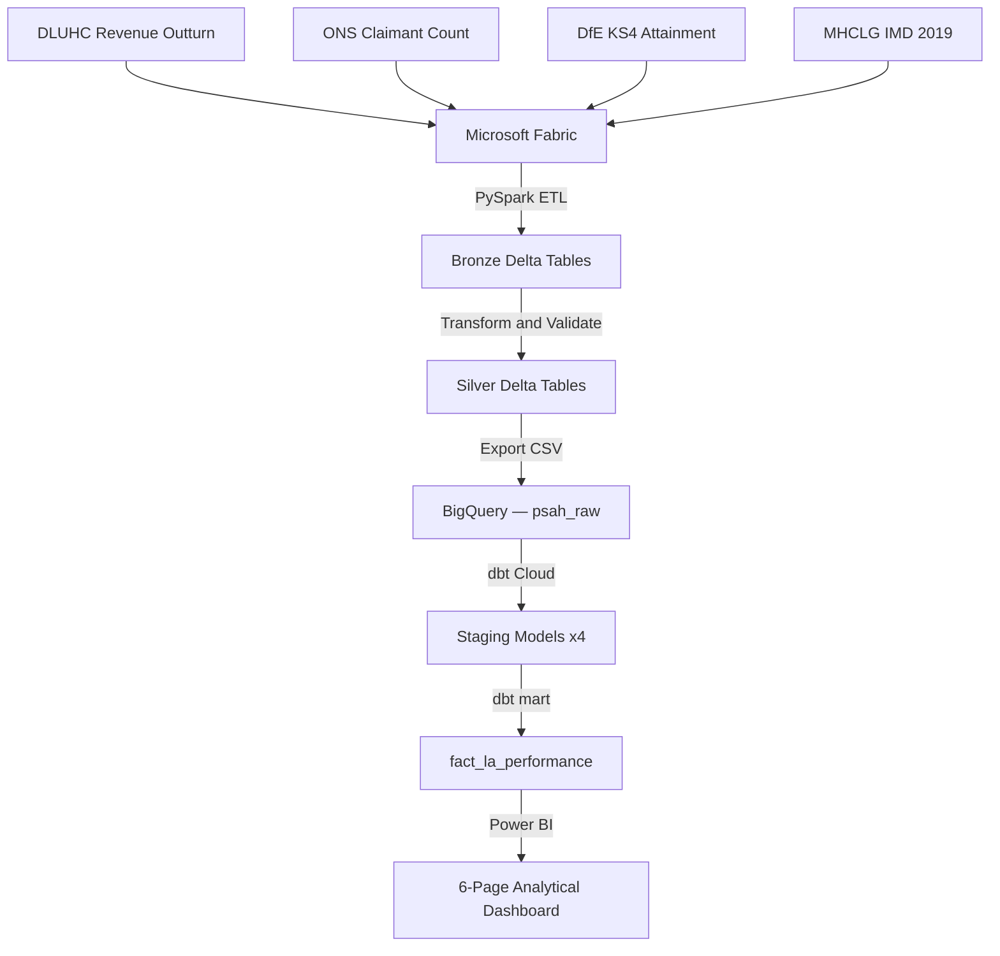

# Public Services Analytics Hub

An end-to-end open data analytics pipeline analysing UK local authority 
performance across expenditure, deprivation, educational attainment, and 
labour market indicators. Built on Microsoft Fabric, dbt Cloud, BigQuery, 
and Power BI using four publicly available government datasets.

Built by [Dorcas Aina](https://dorcasainaa-dotcom.github.io) — Analytics 
Engineer | ISO/IEC 42001:2023 Lead Auditor | MSc Business Analytics (Distinction).

---

## Architecture

---

## Datasets

| Dataset | Source | Grain | Updated |
|---|---|---|---|
| Revenue Outturn RS | DLUHC / GOV.UK | LA × Financial Year | Annually |
| Claimant Count | ONS | LA snapshot | Monthly |
| KS4 Attainment | DfE | LA × Academic Year | Annually |
| Index of Multiple Deprivation | MHCLG | LA | Every 4-5 years |

---

## Pipeline

**Layer 1 — Bronze (Microsoft Fabric)**
Raw CSV ingestion into Delta tables via PySpark notebooks. One table per 
dataset. No transformations applied — raw data preserved as landed.

**Layer 2 — Silver (Microsoft Fabric)**
Cleaned and standardised Delta tables. Column names normalised, data types 
cast, nulls handled, and authority codes validated. Stored in the Bronze 
Lakehouse due to Fabric trial cross-Lakehouse limitations — documented and 
does not affect downstream processing.

**Layer 3 — Gold (BigQuery + dbt Cloud)**
Four staging models clean and rename columns. One mart model 
(`fact_la_performance`) joins all four datasets at local authority level — 
one row per LA per financial year, with KS4 and IMD as point-in-time lookups.

---

## dbt Models

| Model | Layer | Description |
|---|---|---|
| `stg_la_expenditure` | Staging | DLUHC revenue expenditure by service area |
| `stg_claimant_count` | Staging | ONS claimant count snapshot |
| `stg_ks4_attainment` | Staging | DfE KS4 attainment metrics |
| `stg_imd` | Staging | IMD deprivation scores and ranks |
| `fact_la_performance` | Mart | Joined fact table — one row per LA per year |

All staging models pass dbt `not_null` and `unique` tests.

---

## Dashboard

Six-page Power BI report built on `fact_la_performance`:

| Page | Description |
|---|---|
| LA Performance Overview | Executive KPIs, expenditure trends, deprivation vs attainment scatter |
| Expenditure Breakdown | Service area composition, spending trends over time |
| Deprivation & Social Inequality | IMD analysis, spending vs deprivation |
| Educational Attainment | KS4 outcomes, top and bottom LAs, deprivation correlation |
| Labour Market Analysis | Claimant rates, unemployment vs deprivation and attainment |
| LA Performance Deep Dive | Interactive single-LA benchmarking profile |

---

## Key Findings

- Adult social care's share of LA spending grew from 25% to 28% between 
  2017/18 and 2024/25, consistent with increasing demand from an ageing population
- A clear negative correlation exists between deprivation score and KS4 
  attainment — more deprived LAs consistently achieve lower Attainment 8 scores
- Birmingham has the highest claimant rate of any LA at 9.9%, more than double 
  the national average of 3.46%
- Greater London Authority shows zero adult and children's social care expenditure 
  — correct, as these services are delivered by the 32 London Boroughs
- Shire counties (Kent, Lancashire, Hampshire) are the highest total spenders 
  due to their county-wide service delivery responsibilities

---

## Repository Structure
public-services-analytics-hub/
├── notebooks/
│   ├── bronze/          — PySpark ingestion notebooks (4 datasets)
│   ├── silver/          — Transformation notebooks
│   └── gold/            — Gold layer reference
├── models/
│   ├── staging/         — dbt staging models and schema.yml
│   └── marts/           — fact_la_performance.sql
├── powerbi/             — Power BI report (.pbix)
├── data/                — Reference data
├── docs/                — Project documentation
├── dbt_project.yml      — dbt project configuration
└── README.md

---

## How to Replicate

1. Download the four source datasets from GOV.UK, ONS, DfE, and MHCLG
2. Create a Microsoft Fabric workspace and upload source files to a Lakehouse
3. Run the Bronze notebooks in `notebooks/bronze/` to ingest raw data
4. Run Silver transformation code to clean and standardise
5. Export Silver tables as CSV and upload to BigQuery under dataset `psah_raw`
6. Connect dbt Cloud to BigQuery and run `dbt build` to create all models
7. Connect Power BI Desktop to BigQuery and open the report from `powerbi/`

---

## Tools and Technologies

Microsoft Fabric · PySpark · Delta Lake · BigQuery · dbt Cloud · 
Power BI · DAX · Python · SQL · GitHub

---

## Part of the Public Services Analytics Hub

This repo is the flagship project of the 
[public-services-analytics-hub](https://github.com/public-services-analytics-hub) 
GitHub organisation — an open analytics ecosystem for UK public sector data.

---

## Licence

MIT — free to use, adapt, and share with attribution.